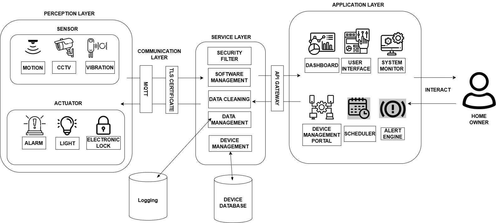

# IoT-Enabled Smart Home System with Integrated Security Features (Ongoing)
---
### Overview
A security-focused smart home system that integrates physical and cybersecurity protections for IoT devices. The project implements defenses against key tampering, node tampering, key cloning, power outages, and DDoS attacks through mechanisms such as watchdog monitoring, heartbeat verification, and tamper detection. The goal is to improve the resilience, reliability, and trustworthiness of smart home environments.

Current Status:
🟡 Development Phase

## Problem Statement

Many smart home systems prioritize convenience over security, making them vulnerable to device tampering, credential theft, service disruption, and hardware failures.

## Objectives

- Detect key tampering attempts
- Prevent key cloning attacks
- Detect node tampering
- Maintain availability during power disruptions
- Mitigate DDoS attacks
- Implement self-recovery mechanisms

## Security Features

### Physical Security

- Key tampering detection
- Node tampering detection
- Key cloning prevention

### Cyber Security

- DDoS mitigation
- Authentication controls
- Secure communication

### Reliability

- Heartbeat monitoring
- Watchdog recovery
- Power outage handling

## System Architecture

## System Layout

## Technologies Used

- ESP32
- Arduino
- MQTT
- MongoDB
- C++
- Node-RED
